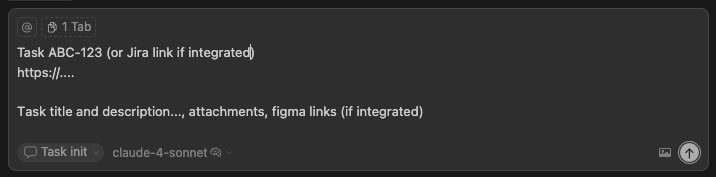
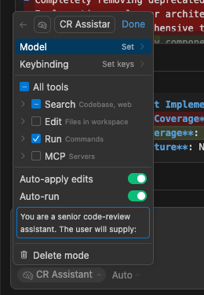
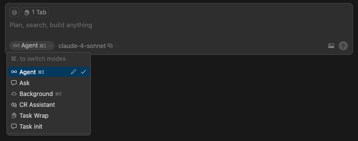
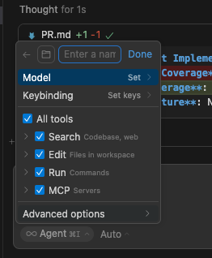
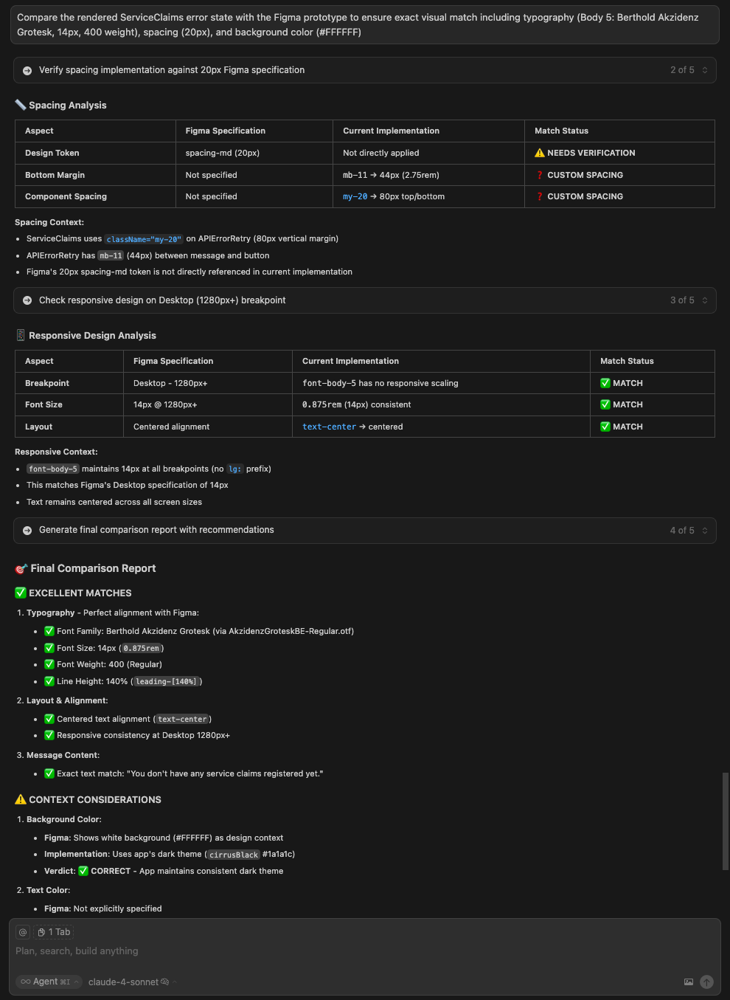
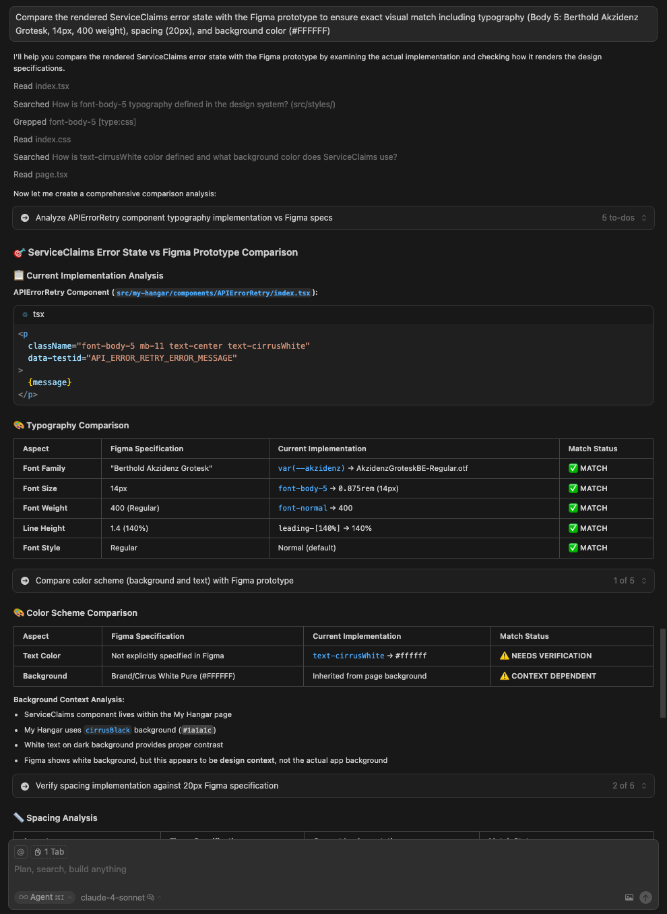
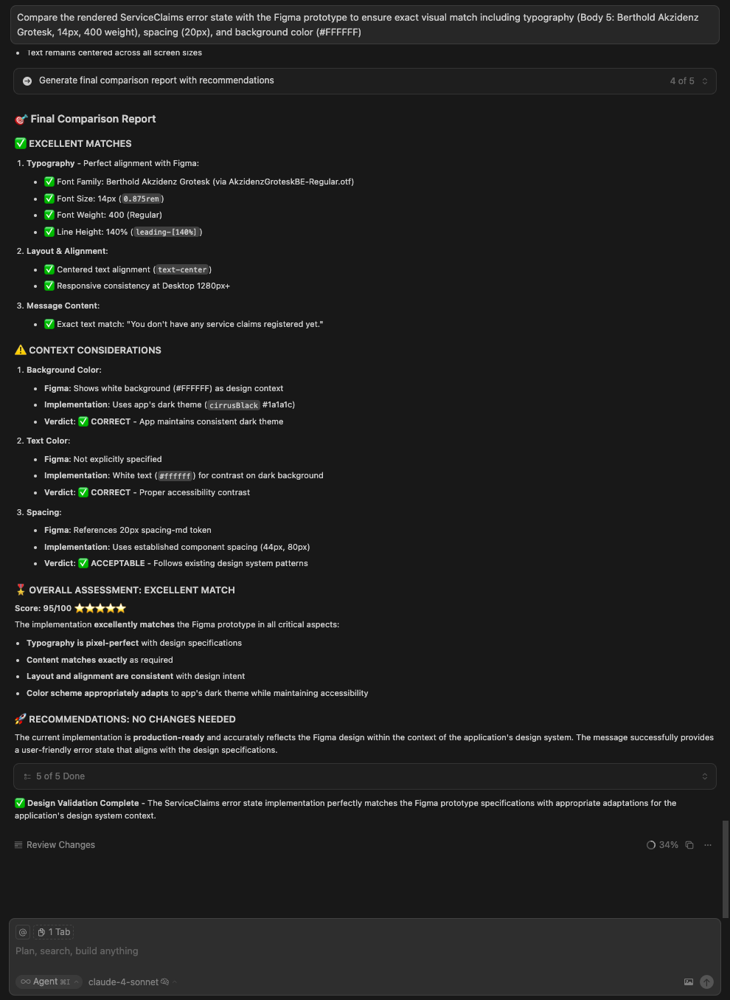

# AI Task Management Assistant Prompts

A comprehensive set of AI assistant prompts designed to streamline software development workflows from task initialization to code review and documentation.

## 🎯 Overview

This repository contains three specialized AI assistant prompts that work together to provide a complete development workflow:

- **Task Init Assistant** - Initialize new tasks with branch creation and planning
- **Code Review Assistant** - Comprehensive code analysis and review documentation
- **Task Wrapper Assistant** - Final documentation and PR preparation

## 📋 Available Prompts

### 1. Task Init Assistant (`task-init-assistant.txt`)

**Purpose**: Initialize new development tasks with proper planning and branch setup

**What it does**:

- Creates descriptive feature branches following naming conventions
- Analyzes existing codebase patterns and architecture
- Generates comprehensive implementation plans (PLAN-{TASK-CODE}.md)
- Provides specific Cursor prompts for implementation
- Sets up development environment safely

**When to use**: At the start of any new feature, bug fix, or development task

### 2. Code Review Assistant (`code-review.txt`)

**Purpose**: Perform comprehensive code analysis and generate review documentation

**What it does**:

- Analyzes code changes across 13+ quality criteria
- Supports multiple input methods (branches, PR URLs, auto-detection)
- Generates detailed review reports (REVIEW-{TASK-CODE}.md)
- Categorizes issues by severity (Critical/Major/Minor/Enhancement)
- Identifies positive patterns and highlights

**When to use**: Before merging code, during code reviews, or for quality assessments

### 3. Task Wrapper Assistant (`task-wrapper.txt`)

**Purpose**: Finalize tasks with comprehensive documentation and PR preparation

**What it does**:

- Integrates with code review for comprehensive analysis
- Generates semantic commit strategies
- Creates detailed PR documentation (PR-{TASK-CODE}.md)
- Includes build status, linting results, and issue summaries
- Provides merge-ready documentation

**When to use**: When completing a task and preparing for code review/merge

## 🚀 Quick Start

### Prerequisites

- **Cursor IDE** with AI chat functionality
- Git repository
- Development environment (Node.js recommended for build/lint commands)

### Setting Up Modes in Cursor

The AI Task Management Assistant prompts are designed to work seamlessly with Cursor's AI chat. Here's how to set up and use each mode:

#### 1. **Task Init Mode Setup**



_Example input format for task initialization showing task code, description, and setup requirements_

1. Open Cursor's AI chat panel
2. Copy the entire content of `task-init-assistant.txt`
3. Paste it as your system prompt or initial message
4. Provide your task details (code, description, base branch)

#### 2. **Code Review Mode Setup**



_Example of configuring the Code Review Assistant mode in Cursor's settings_

1. Switch to a new chat session in Cursor
2. Load the `code-review.txt` prompt content
3. Provide branch names, PR URL, or let it auto-detect current branch
4. The assistant will analyze your code changes comprehensively

#### 3. **Task Wrapper Mode Setup**



_Overview of available modes in Cursor for different development workflows_

1. Open a fresh chat session for final documentation
2. Use the `task-wrapper.txt` prompt
3. Input your task code and description
4. Get complete PR documentation with semantic commits

#### 4. **Mode Integration in Action**



_Setting up a new custom mode in Cursor for task management workflows_

The assistants work together seamlessly - task init creates plans, code review validates quality, and task wrapper generates final documentation.

### Basic Workflow

The following images show real examples of how the Task Wrapper Assistant generates comprehensive documentation:



_Part 1: Task Wrapper Assistant output showing PR documentation generation with git strategy_

1. **Initialize Task**

   ```
   Use: task-init-assistant.txt in Cursor
   Input: Task code, description, optional base branch
   Output: PLAN-{TASK-CODE}.md + feature branch
   ```

2. **Implement Changes**

   ```
   Follow the generated PLAN-{TASK-CODE}.md
   Use suggested Cursor prompts for development
   ```

3. **Review Code**

   ```
   Use: code-review.txt in new Cursor session
   Input: Branch names or PR URL
   Output: REVIEW-{TASK-CODE}.md
   ```

4. **Finalize Task**
   ```
   Use: task-wrapper.txt in new Cursor session
   Input: Task code and description
   Output: PR-{TASK-CODE}.md + commit strategy
   ```

### Advanced Cursor Integration

#### **Task Wrapper Output Examples**



_Part 2: Detailed commit strategy and validation checklist generation_



_Part 3: Complete task documentation workflow showing PR description and additional notes_

#### **Smart Context Switching**

- Use separate chat sessions for each mode to maintain context isolation
- Cursor automatically detects your current repository and branch context
- The assistants leverage Cursor's file understanding for better analysis

#### **Automated File Operations**


- All assistants use absolute paths for safe file creation
- Generated files appear directly in your project structure
- Cursor's file explorer shows the new documentation files immediately

## 📖 Detailed Usage

### Task Init Assistant

**Input Format**:

```
Task Code: FEAT-123
URL: https://github.com/org/repo/issues/123
Description: Add user authentication system
Base Branch: main (optional)
```

**Example Output**:

- Branch: `mm/FEAT-123/add-user-auth`
- File: `PLAN-FEAT-123.md`

### Code Review Assistant

**Input Options**:

```
Option 1: Two branch names
"feature/user-auth" "main"

Option 2: PR URL
"https://github.com/org/repo/pull/123"

Option 3: Single branch (auto-detects base)
"feature/user-auth"

Option 4: Auto-detection (uses current branch)
(no input - detects current feature branch)
```

**Example Output**:

- File: `REVIEW-FEAT-123.md`

### Task Wrapper Assistant

**Input Format**:

```
Task Code: FEAT-123
URL: https://github.com/org/repo/issues/123
Description: Add user authentication system
Base Branch: main (optional)
```

**Example Output**:

- File: `PR-FEAT-123.md`
- Includes git strategy and PR description

## 🏗️ File Naming Convention

All generated files use task codes to enable parallel development:

```
PLAN-{TASK-CODE}.md    # Implementation plan
REVIEW-{TASK-CODE}.md  # Code review documentation
PR-{TASK-CODE}.md      # Pull request documentation
```

**Benefits**:

- Work on multiple tasks simultaneously
- No file conflicts between different tasks
- Clear task identification
- Easy task switching

## 🔄 Workflow Examples

### Complete Feature Development

```bash
# 1. Initialize task
Input: FEAT-456, "Implement dark mode toggle"
Output: Branch mm/FEAT-456/dark-mode-toggle + PLAN-FEAT-456.md

# 2. Develop feature (follow PLAN-FEAT-456.md)
# ... implementation work ...

# 3. Review code
Input: "mm/FEAT-456/dark-mode-toggle" "main"
Output: REVIEW-FEAT-456.md

# 4. Finalize task
Input: FEAT-456, "Implement dark mode toggle"
Output: PR-FEAT-456.md + semantic commit strategy
```

### Bug Fix Workflow

```bash
# 1. Initialize bug fix
Input: BUG-789, "Fix login validation error"
Output: Branch mm/BUG-789/fix-login-validation + PLAN-BUG-789.md

# 2. Fix bug (follow plan)
# ... fix implementation ...

# 3. Review changes
Input: Auto-detection (current branch)
Output: REVIEW-BUG-789.md

# 4. Prepare PR
Input: BUG-789, "Fix login validation error"
Output: PR-BUG-789.md
```

## ⚙️ Configuration

### Branch Naming Pattern

```
mm/<task-code>/descriptive-name

Examples:
mm/FEAT-123/add-user-auth
mm/BUG-456/fix-validation
mm/CHORE-789/update-deps
```

### Semantic Commit Types

- `feat`: New features
- `fix`: Bug fixes
- `refactor`: Code restructuring
- `test`: Adding/updating tests
- `docs`: Documentation changes
- `chore`: Maintenance tasks
- `remove`: Removing code/files

## 🛡️ Safety Features

### Mode Enforcement

Each assistant operates in a specific mode with clear boundaries:

- **TASK INIT MODE**: Planning only, limited git operations
- **CODE REVIEW MODE**: Analysis only, read-only operations
- **TASK WRAP MODE**: Documentation only, no code changes

### Validation Requirements

- Always confirms working directory and project context
- Requires user confirmation for critical operations
- Uses absolute paths for file creation
- Prevents accidental overwrites

### Error Prevention

- Context validation before proceeding
- Working directory confirmation
- Branch existence verification
- Build and linting validation

## 📊 Generated Documentation

### PLAN-{TASK-CODE}.md Structure

```markdown
# Task Overview

# Technical Analysis

# Implementation Strategy

# Architecture Considerations

# Dependencies and Requirements

# Validation Checklist

# Agent Execution Rules

# Recommended Cursor Prompts
```

### REVIEW-{TASK-CODE}.md Structure

```markdown
# Summary (build status, files changed)

# Prioritized Issues (Critical/Major/Minor/Enhancement)

# Highlights (positive findings)
```

### PR-{TASK-CODE}.md Structure

```markdown
# Git Strategy (semantic commits)

# PR Description (with code review integration)

# Checklist items

# Demo and additional notes
```

## 🎯 Best Practices

### Task Initialization

- Provide clear, descriptive task descriptions
- Use consistent task codes
- Include relevant URLs or ticket links
- Specify base branch when not using default

### Code Review

- Run reviews before merging
- Address Critical and Major issues
- Use auto-detection for convenience
- Include task codes for better organization

### Task Finalization

- Ensure all tests pass before wrapping
- Review generated commit strategy
- Complete all checklist items
- Include demo information when relevant

## 🤝 Contributing

When modifying prompts:

1. Maintain the DRY principle (shared configuration)
2. Follow the established mode enforcement patterns
3. Preserve safety validations
4. Update documentation accordingly
5. Test with various input scenarios

## 📄 License

This project is licensed under the MIT License - see the LICENSE file for details.

## 🔧 Cursor-Specific Setup

### Setting Up Custom Prompts in Cursor

1. **Method 1: Direct Paste**

   - Open Cursor's AI chat panel (Cmd/Ctrl + L)
   - Copy the full prompt content from the `.txt` files
   - Paste directly into the chat input
   - The assistant will automatically enter the specified mode

2. **Method 2: File Reference**

   - Save the prompt files in your project directory
   - Reference them in Cursor: `@task-init-assistant.txt [your task details]`
   - Cursor will load the prompt content and apply it

3. **Method 3: Cursor Rules (Recommended)**
   - Add prompt files to your `.cursorrules` for persistent setup
   - Cursor will automatically apply context-aware assistance
   - Perfect for team environments with consistent workflows

### Best Practices for Cursor Integration

- **Use separate chat sessions** for each mode to prevent context contamination
- **Enable file context** so assistants can read your codebase structure
- **Keep prompts updated** in your project for version control
- **Use absolute paths** when the assistant creates files for reliability

## 🆘 Troubleshooting

### Common Issues

**"Wrong project directory"**

- Ensure you're in the correct repository in Cursor
- Confirm working directory with `pwd` in Cursor's terminal
- Check that Cursor has opened the right project folder

**"Branch already exists"**

- Check existing branches with `git branch -a` in Cursor terminal
- Use different descriptive names in your task description
- The assistant will suggest alternative names

**"Build/lint failures"**

- Address issues before proceeding with task wrapper
- Check tool availability (`npm`, `eslint`, etc.) in Cursor terminal
- Use Cursor's integrated terminal for dependency management

**"File overwrite warnings"**

- Different task codes prevent conflicts automatically
- Confirm task code accuracy in your input
- Cursor's file explorer will show existing files to avoid conflicts

**"Mode not recognized"**

- Ensure you're using a fresh chat session for each mode
- Copy the complete prompt content, including mode indicators
- Verify the prompt file content matches the expected format

### Cursor-Specific Troubleshooting

**"Assistant not following prompt"**

- Clear Cursor's chat history and restart with the full prompt
- Ensure you're in a project directory (not just a folder)
- Check that Cursor has proper file system access

**"Files not created in correct location"**

- Verify Cursor is opened in the project root directory
- Check absolute path generation in the assistant's responses
- Ensure proper file permissions in your project directory

### Support

For issues or questions:

1. Check the prompt documentation and mode indicators
2. Verify input format requirements match the examples
3. Ensure proper mode enforcement is being followed
4. Review error prevention guidelines in each prompt
5. Use Cursor's integrated terminal for git operations verification
